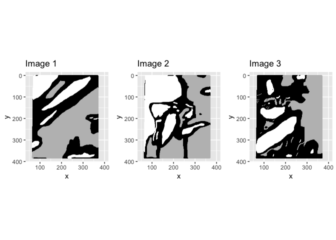

proj2
================
Xuanfu Lu
4/16/2019

``` r
# graphing
library(ggplot2)
library(gridExtra)
library(plotly)
```

    ## 
    ## Attaching package: 'plotly'

    ## The following object is masked from 'package:ggplot2':
    ## 
    ##     last_plot

    ## The following object is masked from 'package:stats':
    ## 
    ##     filter

    ## The following object is masked from 'package:graphics':
    ## 
    ##     layout

``` r
library(corrgram)
library(corrplot)
```

    ## corrplot 0.84 loaded

``` r
# maybe helpful in the PCA analysis
library(ggfortify)  
library(FactoMineR)
library(factoextra)
```

    ## Welcome! Related Books: `Practical Guide To Cluster Analysis in R` at https://goo.gl/13EFCZ

``` r
# CV & modeling
library(MASS)
```

    ## 
    ## Attaching package: 'MASS'

    ## The following object is masked from 'package:plotly':
    ## 
    ##     select

``` r
library(caret)
```

    ## Loading required package: lattice

    ## 
    ## Attaching package: 'lattice'

    ## The following object is masked from 'package:corrgram':
    ## 
    ##     panel.fill

``` r
library('e1071')

# ROC
library(ROCR)
```

    ## Loading required package: gplots

    ## 
    ## Attaching package: 'gplots'

    ## The following object is masked from 'package:stats':
    ## 
    ##     lowess

``` r
library(gplots)

# AIC
library(mvtnorm)
```

``` r
# read image_data (this step can take quite some time)
image1 <- read.csv(file = "image_data/image1.txt", sep ="", header = FALSE)
image2 <- read.csv(file = "image_data/image2.txt", sep ="", header = FALSE)
image3 <- read.csv(file = "image_data/image3.txt", sep ="", header = FALSE)

# change the column names for better understanding
feature_name <- c("y", "x", "expert", "NDAI", "SD", "CORR", "DF", "CF", "BF", "AF", "AN")
colnames(image1) <- feature_name
colnames(image2) <- feature_name
colnames(image3) <- feature_name

# aggregate the data
image0 <- rbind(image1, image2, image3)
image0_labeled <- image0[image0$expert!=0,]

# Ham: make the same for image 1,2,3 as well
image1_labeled <- image1[image1$expert != 0,]
image2_labeled <- image2[image2$expert != 0,]
image3_labeled <- image3[image3$expert != 0,]
```

``` r
source("auxiliary_func.R")
```

Part I: Data Collection and Exploration
=======================================

a) no code
----------

This part involves no code. \#\# b) \#\#\# summarize the data

``` r
# percentage of pixels for the different classes (total image)
class_percentage <- rbind(percent(table(num2class(image1$expert))/nrow(image1)),
                          percent(table(num2class(image2$expert))/nrow(image2)),
                          percent(table(num2class(image3$expert))/nrow(image3)),
                          percent(table(num2class(image0$expert))/nrow(image0)))
rownames(class_percentage) <- c("image1", "image2", "image3", "total")
colnames(class_percentage) <- c("clear", "cloudy", "unlabeled")
class_percentage
```

    ##        clear    cloudy   unlabeled
    ## image1 "43.78%" "17.77%" "38.46%" 
    ## image2 "37.25%" "34.11%" "28.64%" 
    ## image3 "29.29%" "18.44%" "52.27%" 
    ## total  "36.78%" "23.43%" "39.79%"

``` r
# percentage of pixels for the different classes (labeled only)
class_percentage <- rbind(percent(table(num2class(image1_labeled$expert))/nrow(image1_labeled)),
                          percent(table(num2class(image2_labeled$expert))/nrow(image2_labeled)),
                          percent(table(num2class(image3_labeled$expert))/nrow(image3_labeled)),
                          percent(table(num2class(image0_labeled$expert))/nrow(image0_labeled)))
rownames(class_percentage) <- c("image1_labeled", "image2_labeled", "image3_labeled", "total_labeled")
colnames(class_percentage) <- c("clear", "cloudy")
class_percentage
```

    ##                clear    cloudy  
    ## image1_labeled "71.13%" "28.87%"
    ## image2_labeled "52.20%" "47.80%"
    ## image3_labeled "61.37%" "38.63%"
    ## total_labeled  "61.08%" "38.92%"

``` r
# genearl summary of the aggregated image data
summary(image0)
```

    ##        y               x             expert             NDAI        
    ##  Min.   :  2.0   Min.   : 65.0   Min.   :-1.0000   Min.   :-1.8420  
    ##  1st Qu.: 98.0   1st Qu.:143.0   1st Qu.:-1.0000   1st Qu.:-0.4286  
    ##  Median :193.0   Median :218.0   Median : 0.0000   Median : 1.3476  
    ##  Mean   :193.1   Mean   :218.1   Mean   :-0.1334   Mean   : 1.0847  
    ##  3rd Qu.:289.0   3rd Qu.:294.0   3rd Qu.: 0.0000   3rd Qu.: 2.3142  
    ##  Max.   :383.0   Max.   :369.0   Max.   : 1.0000   Max.   : 4.5639  
    ##        SD                CORR               DF               CF        
    ##  Min.   :  0.1987   Min.   :-0.3872   Min.   : 45.28   Min.   : 31.19  
    ##  1st Qu.:  1.6376   1st Qu.: 0.1253   1st Qu.:244.56   1st Qu.:219.27  
    ##  Median :  4.3095   Median : 0.1603   Median :281.91   Median :259.31  
    ##  Mean   :  8.0633   Mean   : 0.1860   Mean   :271.36   Mean   :246.37  
    ##  3rd Qu.: 10.2264   3rd Qu.: 0.2231   3rd Qu.:300.39   3rd Qu.:279.59  
    ##  Max.   :117.5810   Max.   : 0.8144   Max.   :410.53   Max.   :360.68  
    ##        BF               AF               AN        
    ##  Min.   : 24.49   Min.   : 21.07   Min.   : 20.57  
    ##  1st Qu.:200.79   1st Qu.:185.16   1st Qu.:174.88  
    ##  Median :236.17   Median :211.54   Median :197.58  
    ##  Mean   :224.20   Mean   :201.71   Mean   :188.29  
    ##  3rd Qu.:258.62   3rd Qu.:235.15   3rd Qu.:216.80  
    ##  Max.   :335.08   Max.   :318.70   Max.   :306.93

``` r
# Ham: add some summary just in case
summary(image1)
```

    ##        y               x             expert             NDAI        
    ##  Min.   :  2.0   Min.   : 65.0   Min.   :-1.0000   Min.   :-1.6172  
    ##  1st Qu.: 98.0   1st Qu.:143.0   1st Qu.:-1.0000   1st Qu.:-0.5284  
    ##  Median :193.0   Median :218.0   Median : 0.0000   Median : 0.8591  
    ##  Mean   :193.2   Mean   :218.3   Mean   :-0.2601   Mean   : 0.8712  
    ##  3rd Qu.:289.0   3rd Qu.:294.0   3rd Qu.: 0.0000   3rd Qu.: 2.0894  
    ##  Max.   :383.0   Max.   :369.0   Max.   : 1.0000   Max.   : 4.3937  
    ##        SD               CORR               DF               CF        
    ##  Min.   : 0.2515   Min.   :-0.3271   Min.   : 62.01   Min.   : 38.15  
    ##  1st Qu.: 1.4647   1st Qu.: 0.1178   1st Qu.:260.35   1st Qu.:245.78  
    ##  Median : 2.8897   Median : 0.1510   Median :285.52   Median :269.69  
    ##  Mean   : 5.3720   Mean   : 0.1602   Mean   :272.05   Mean   :254.09  
    ##  3rd Qu.: 6.6511   3rd Qu.: 0.1747   3rd Qu.:300.28   3rd Qu.:283.68  
    ##  Max.   :81.5354   Max.   : 0.7508   Max.   :367.47   Max.   :335.25  
    ##        BF               AF               AN        
    ##  Min.   : 32.09   Min.   : 28.94   Min.   : 31.94  
    ##  1st Qu.:231.36   1st Qu.:212.54   1st Qu.:199.40  
    ##  Median :255.84   Median :234.78   Median :215.09  
    ##  Mean   :237.38   Mean   :215.89   Mean   :199.87  
    ##  3rd Qu.:266.41   3rd Qu.:240.76   3rd Qu.:222.02  
    ##  Max.   :335.08   Max.   :318.70   Max.   :306.93

``` r
summary(image2)
```

    ##        y             x             expert              NDAI        
    ##  Min.   :  2   Min.   : 65.0   Min.   :-1.00000   Min.   :-1.6811  
    ##  1st Qu.: 98   1st Qu.:142.2   1st Qu.:-1.00000   1st Qu.:-0.5094  
    ##  Median :193   Median :218.0   Median : 0.00000   Median : 1.5720  
    ##  Mean   :193   Mean   :217.8   Mean   :-0.03141   Mean   : 1.1157  
    ##  3rd Qu.:289   3rd Qu.:293.0   3rd Qu.: 1.00000   3rd Qu.: 2.3344  
    ##  Max.   :383   Max.   :368.0   Max.   : 1.00000   Max.   : 4.4062  
    ##        SD                CORR               DF               CF        
    ##  Min.   :  0.2506   Min.   :-0.2458   Min.   : 45.28   Min.   : 31.19  
    ##  1st Qu.:  2.0639   1st Qu.: 0.1392   1st Qu.:280.84   1st Qu.:248.21  
    ##  Median :  5.6456   Median : 0.1992   Median :294.10   Median :272.79  
    ##  Mean   :  8.4185   Mean   : 0.2302   Mean   :295.56   Mean   :262.24  
    ##  3rd Qu.: 11.0954   3rd Qu.: 0.2766   3rd Qu.:317.36   3rd Qu.:283.65  
    ##  Max.   :110.4676   Max.   : 0.8144   Max.   :389.66   Max.   :355.45  
    ##        BF               AF               AN        
    ##  Min.   : 24.49   Min.   : 21.06   Min.   : 20.57  
    ##  1st Qu.:217.03   1st Qu.:187.89   1st Qu.:175.47  
    ##  Median :246.16   Median :217.95   Median :202.83  
    ##  Mean   :230.91   Mean   :202.61   Mean   :188.63  
    ##  3rd Qu.:259.45   3rd Qu.:233.34   3rd Qu.:217.89  
    ##  Max.   :327.06   Max.   :308.99   Max.   :299.48

``` r
summary(image3)
```

    ##        y               x             expert             NDAI        
    ##  Min.   :  2.0   Min.   : 65.0   Min.   :-1.0000   Min.   :-1.8420  
    ##  1st Qu.: 98.0   1st Qu.:143.0   1st Qu.:-1.0000   1st Qu.: 0.0188  
    ##  Median :193.0   Median :218.0   Median : 0.0000   Median : 1.4720  
    ##  Mean   :193.1   Mean   :218.3   Mean   :-0.1086   Mean   : 1.2672  
    ##  3rd Qu.:289.0   3rd Qu.:294.0   3rd Qu.: 0.0000   3rd Qu.: 2.5143  
    ##  Max.   :383.0   Max.   :369.0   Max.   : 1.0000   Max.   : 4.5639  
    ##        SD                CORR               DF               CF        
    ##  Min.   :  0.1987   Min.   :-0.3872   Min.   : 61.03   Min.   : 43.66  
    ##  1st Qu.:  1.5661   1st Qu.: 0.1055   1st Qu.:221.37   1st Qu.:206.54  
    ##  Median :  5.0586   Median : 0.1556   Median :243.45   Median :221.23  
    ##  Mean   : 10.4000   Mean   : 0.1678   Mean   :246.51   Mean   :222.81  
    ##  3rd Qu.: 14.3390   3rd Qu.: 0.2065   3rd Qu.:277.19   3rd Qu.:250.34  
    ##  Max.   :117.5810   Max.   : 0.7892   Max.   :410.53   Max.   :360.68  
    ##        BF               AF               AN        
    ##  Min.   : 37.54   Min.   : 33.66   Min.   : 30.81  
    ##  1st Qu.:192.69   1st Qu.:175.18   1st Qu.:164.98  
    ##  Median :205.36   Median :191.78   Median :184.32  
    ##  Mean   :204.32   Mean   :186.64   Mean   :176.37  
    ##  3rd Qu.:227.55   3rd Qu.:205.81   3rd Qu.:193.63  
    ##  Max.   :315.55   Max.   :304.06   Max.   :293.62

SUMMARY: for entire image data, the range of x, y coordinats is \[65,369\] and \[2,383\], respectively. SUMMARY: DF,CF,BF,AF,AN have similar range but in decreasing order. SUMMARY: in the labeled data, number of clear pixel is bigger than number of cloudy pixel. \#\#\# plot well-labeled maps

``` r
# graphing (this step can take quite some time)
# note: I flipped the y-axis to make graphs consistent with graphs in the paper
i1 <- ggplot(data = image1, aes(x = x, y = y)) +
  geom_point(colour = num2col(image1$expert), size = 0.1) +
  xlim(50,400) + ylim(0,400) + coord_fixed(ratio = 1) +
  labs(title = "Image 1") + scale_y_reverse()
```

    ## Scale for 'y' is already present. Adding another scale for 'y', which
    ## will replace the existing scale.

``` r
i2 <- ggplot(data = image2, aes(x = x, y = y)) +
  geom_point(colour = num2col(image2$expert), size = 0.1) +
  xlim(50,400) + ylim(0,400) + coord_fixed(ratio = 1) +
  labs(title = "Image 2") + scale_y_reverse()
```

    ## Scale for 'y' is already present. Adding another scale for 'y', which
    ## will replace the existing scale.

``` r
i3 <- ggplot(data = image3, aes(x = x, y = y)) +
  geom_point(colour = num2col(image3$expert), size = 0.1) +
  xlim(50,400) + ylim(0,400) + coord_fixed(ratio = 1) +
  labs(title = "Image 3") + scale_y_reverse()
```

    ## Scale for 'y' is already present. Adding another scale for 'y', which
    ## will replace the existing scale.

``` r
grid.arrange(i1,i2,i3, nrow=1)
```

 OBSERVATION: Clearly, cloudness shows some grouping, which means cloudy area is more likely to have its neighbors being cloudy, and vice versa. Also, the shape and size of the cloudy areas are irregular, although most cloudy areas have an ellipsoid outline. CONCLUSION: i.i.d. assumption is not justified for this data set. \#\#c) EDA \#\#\# pairwise relationships

``` r
# cannot run corrgram() function, takes too long
# try corrplot() function
corrplot.mixed(cor(image0), lower="number", upper="color", order="hclust", tl.col = "black")
```

 OBSERVATION: NDAI is positively correlated with SD, expert label (not very strong correlation though); negatively correlated with all the rest features. OBSERVATION: DF,AF,AN,CF,BF are positively correlated with each other (this is very intuitive). \[validated that these measurements make sense, it's unlikely the case that one of the camera is malfuncitoning\] OBSERVATION: y coordinate is more related to radiance reading than x coordinate.

``` r
# create a data frame containing all 5 radiance readings in the entire data (including unlabeled)
radiance <- image0[,7:11]
# visualize PCA (onto first 2 PC) using standardized data
radiance_std <- scale(radiance, center=TRUE, scale=TRUE)
#Ham: tweak a little to incoporate quantitative information of pca
radiance_pca <- PCA(radiance_std, graph=FALSE)
#Ham: eigenvalues and variance explained 
radiance_pca$eig
```

    ##        eigenvalue percentage of variance cumulative percentage of variance
    ## comp 1 4.22826569             84.5653137                          84.56531
    ## comp 2 0.61008098             12.2016195                          96.76693
    ## comp 3 0.10495903              2.0991807                          98.86611
    ## comp 4 0.04168339              0.8336678                          99.69978
    ## comp 5 0.01501091              0.3002183                         100.00000

``` r
fviz_pca_var(radiance_pca, col.var = "red")
```


``` r
# screeplot
eigenvalues <- eigen(t(radiance_std) %*% radiance_std)$values
plot(cumsum(eigenvalues) / sum(eigenvalues), main = "Scree Plot", ylab = "Eigenvalues", xlab = "Component Number")
```

 OBSERVATION: all radiance readings are positively correlated (they lie in the same direction). OBSERVATION: 1st principal component captures 84.6% of variance. first 2 PCs capture above 96% of the variability. CONCLUSION: studying the radiance readings themself may not have much results; some transformation would be very helpful; the NDAI feature created by Yu Bin and her team is very brilliant in terms of capturing the changes in a scene with changes in the MISR view direction. \#\#\# differences between two classes

``` r
# used auxiliary function to keep it looking tidy
hist_ft <- feature_hist_by_class(image0_labeled)
hist_ft[[1]]
```


``` r
hist_ft[[2]]
```


``` r
hist_ft[[3]]
```


``` r
grid.arrange(hist_ft[[4]], hist_ft[[5]], hist_ft[[6]], hist_ft[[7]], hist_ft[[8]])
```

 OBSERVATION: NDAI feature shows strong diversification for cloudy and clear areas. Very clearly, clear areas have less NDAI than cloudy areas. This feature could be very helpful in later part of the project. OBSERVATION: radiance reading: clear areas seem to have a bimodal histogram of radiance reading (all 5 of them) while cloudy areas have single-mode histogram of radiance reading. Cloudy areas have longer left-side tails. Clear areas seem to have slightly higher radiance reading (this is consistent with the paper finding as well). OBSERVATION: clear areas tend to have smaller SD (shorter right tails, peak around 0) than cloudy areas. OBSERVATION: clear areas tend to have smaller and less spreading CORR than cloudy areas.

``` r
summary(image0[which(image0$expert == 1),]$NDAI)
```

    ##    Min. 1st Qu.  Median    Mean 3rd Qu.    Max. 
    ## -0.5855  1.4936  1.9613  1.9496  2.4120  4.3460

``` r
summary(image0[which(image0$expert == -1),]$NDAI)
```

    ##    Min. 1st Qu.  Median    Mean 3rd Qu.    Max. 
    ## -1.8420 -0.9756 -0.6555 -0.2627  0.1081  4.3387

``` r
summary(image0[which(image0$expert == 1),]$SD)
```

    ##    Min. 1st Qu.  Median    Mean 3rd Qu.    Max. 
    ##  0.3825  4.5864  7.3006  9.8448 12.1102 99.2677

``` r
summary(image0[which(image0$expert == -1),]$SD)
```

    ##     Min.  1st Qu.   Median     Mean  3rd Qu.     Max. 
    ##   0.1987   0.8608   1.4351   2.9785   2.6157 110.4676

``` r
summary(image0[which(image0$expert == 1),]$CORR)
```

    ##    Min. 1st Qu.  Median    Mean 3rd Qu.    Max. 
    ## -0.3537  0.1677  0.2531  0.2630  0.3331  0.8144

``` r
summary(image0[which(image0$expert == -1),]$CORR)
```

    ##    Min. 1st Qu.  Median    Mean 3rd Qu.    Max. 
    ## -0.3617  0.1155  0.1359  0.1401  0.1617  0.7207

Part II: Preparation
====================

a) split data
-------------

``` r
# training data is one of the images
# validation data is one of the other two images
# the last image is the testing data
data_tr1 <- image1
data_va1 <- image2
data_te1 <- image3
# Yu bin says this is NOT OK
```

``` r
# images are already ordered by coordiantes
# first divide the images:
K <- 6
set.seed(154668) # the next few lines of code involve random sampling, set seed to be consistent.
images_divided <- list(divide_image(image1, K), divide_image(image2, K), divide_image(image3, K))

# forge the new images using divided pieces:
new_images <- forge_new_image(images_divided, K)
data_tr2 <- new_images[[1]][new_images[[1]]$expert != 0,]
data_va2 <- new_images[[2]][new_images[[2]]$expert != 0,]
data_te2 <- new_images[[3]][new_images[[3]]$expert != 0,]

# the forged image should look like:
ggplot(data = data_te2, aes(x = x, y = y)) +
  geom_point(colour = num2col(data_te2$expert), size = 0.1) +
  xlim(50,400) + ylim(0,400) + coord_fixed(ratio = 1) +
  labs(title = "forged new image") + scale_y_reverse()
```

    ## Scale for 'y' is already present. Adding another scale for 'y', which
    ## will replace the existing scale.


``` r
# essentially this would be the same as method2
# method2 is stratified random sampling
# method3 is simple random sampling
# they are essentially the same
# this method will not have a graph
set.seed(123456)
# images_divided is already created

# forge the new images using divided pieces:
new_images <- forge_random(images_divided, K)
data_tr3 <- new_images[[1]][new_images[[1]]$expert != 0,]
data_va3 <- new_images[[2]][new_images[[2]]$expert != 0,]
data_te3 <- new_images[[3]][new_images[[3]]$expert != 0,]

ggplot(data = data_te3, aes(x = x, y = y)) +
  geom_point(colour = num2col(data_te3$expert), size = 0.1) +
  xlim(50,400) + ylim(0,400) + coord_fixed(ratio = 1) +
  labs(title = "forged new image") + scale_y_reverse()
```

    ## Scale for 'y' is already present. Adding another scale for 'y', which
    ## will replace the existing scale.

 the image is normal, because this is completely randomly sampling. there exist some missing areas because there exist equal number of overlapping areas.

``` r
# read the blurred images (they are constructed using a separate R. file)
# constructing superpixels are computational complex, takes too much time, thus done separately
image1_blur <- read.csv(file = "image_data/image1_blur.csv", header = TRUE)
image2_blur <- read.csv(file = "image_data/image2_blur.csv", header = TRUE)
image3_blur <- read.csv(file = "image_data/image3_blur.csv", header = TRUE)
image1_blur <- image1_blur[,2:12]
image2_blur <- image2_blur[,2:12]
image3_blur <- image3_blur[,2:12]
image0_blur <- rbind(image1_blur, image2_blur, image3_blur)

# randomly select pixels from the all constructed super pixels:
temp_storage <- rep(list(NA), 3)
select_index <- 1:nrow(image0_blur)
for (i in 1:3) {
  temp_index <- sample(na.omit(select_index), size = nrow(image0_blur) %/% 3)
  select_index[temp_index] <- NA
  temp_storage[[i]] <- image0_blur[temp_index,]
}
data_tr4 <- temp_storage[[1]]
data_va4 <- temp_storage[[2]]
data_te4 <- temp_storage[[3]]

# plot the blurred image (just to demonstrate)
i1 <- ggplot(data = image1_blur, aes(x = x, y = y)) +
  geom_point(colour = num2col(image1_blur$expert), size = 0.9) +
  xlim(50,400) + ylim(0,400) + coord_fixed(ratio = 1) +
  labs(title = "Image 1 (super-pixel)") + scale_y_reverse()
```

    ## Scale for 'y' is already present. Adding another scale for 'y', which
    ## will replace the existing scale.

``` r
i2 <- ggplot(data = image2_blur, aes(x = x, y = y)) +
  geom_point(colour = num2col(image2_blur$expert), size = 0.9) +
  xlim(50,400) + ylim(0,400) + coord_fixed(ratio = 1) +
  labs(title = "Image 2 (super-pixel)") + scale_y_reverse()
```

    ## Scale for 'y' is already present. Adding another scale for 'y', which
    ## will replace the existing scale.

``` r
i3 <- ggplot(data = image3_blur, aes(x = x, y = y)) +
  geom_point(colour = num2col(image3_blur$expert), size = 0.9) +
  xlim(50,400) + ylim(0,400) + coord_fixed(ratio = 1) +
  labs(title = "Image 3 (super-pixel)") + scale_y_reverse()
```

    ## Scale for 'y' is already present. Adding another scale for 'y', which
    ## will replace the existing scale.

``` r
grid.arrange(i1,i2,i3, nrow=1)
```

 method4 could potentially be the most helpful method, but the drawback is also very obvious: reduced number of observations method4 takes account of dependency of pixels with neighborhood. In later part we will show that x, y coordinates are not our "best" features, and they will not be passed into modeling. Therefore, method4 (blurring / smoothing) is the only way to take dependancy into account for modeling. \#\# b) trivial classifier The best splitting method's accuracy using a trivial classifier should be around the true percent of "clear" label in the entire given data. It means that the splitting does a good job in representing the whole data. The trivial classifier will have high accuracy if the data split is not good in the sense that it splits almost all the terrain into the testing data. It is the only occassian where the trivial classifier obtains high accuracy. However, this splitting is problematic because it does not represent the reality. Because the trivial classifier does not do well according to our way of splitting the data, we can be more certain that our splitting method is not trivial. Also, for methods with "good" trivial accuracy, we will run additional stability test to select the best splitting method.

``` r
# since method1 only has 6 possible combinations, we are going to exhaust
a1 <- sum(image1_labeled$expert == -1)/nrow(image1_labeled)
a2 <- sum(image2_labeled$expert == -1)/nrow(image2_labeled)
a3 <- sum(image3_labeled$expert == -1)/nrow(image3_labeled)
accuracy_report1 <- rbind(c(a2,a3), c(a3,a2), c(a1,a2), c(a2,a1), c(a1,a3), c(a3,a1))
accuracy_report1 <- rbind(accuracy_report1, c(mean(accuracy_report1[,1]), mean(accuracy_report1[,2])))
accuracy_report1 <- as.data.frame(accuracy_report1)
colnames(accuracy_report1) <- c("val_accuracy","test_accuracy")
rownames(accuracy_report1) <- c(1:6,"average")
accuracy_report1
```

    ##         val_accuracy test_accuracy
    ## 1          0.5220091     0.6137174
    ## 2          0.6137174     0.5220091
    ## 3          0.7113386     0.5220091
    ## 4          0.5220091     0.7113386
    ## 5          0.7113386     0.6137174
    ## 6          0.6137174     0.7113386
    ## average    0.6156883     0.6156883

OBSERVATION: trivial splitting result is not very good, the stability is very week (we can tell this without calculating the sd), and the average is away from the true label percentage. keep in mind that the total observations has 61.08% of pixels labeled as "clear".

``` r
stability_report2 <- data.frame()
# run method 2 by changing seed
for (i in 1:10) {
  set.seed(i + 500) # change seed in each iteration
  # split the data
  new_images <- forge_new_image(images_divided, K)
  data_tr2 <- new_images[[1]][new_images[[1]]$expert != 0,]
  data_va2 <- new_images[[2]][new_images[[2]]$expert != 0,]
  data_te2 <- new_images[[3]][new_images[[3]]$expert != 0,]
  # report accuracy
  a1 <- sum(data_va2$expert == -1)/nrow(data_va2)
  a2 <- sum(data_te2$expert == -1)/nrow(data_te2)
  stability_report2 <- rbind(stability_report2, data.frame(val_accuracy = a1, test_accuracy = a2))
}
# round off the numbers (purely aesthetic purposes)
stability_report2 <- round(stability_report2, digits = 5)
temp_v_mean <- round(mean(stability_report2$val_accuracy), digit = 5)
temp_v_sd <- round(sd(stability_report2$val_accuracy), digit = 5)
temp_t_mean <- round(mean(stability_report2$test_accuracy), digit = 5)
temp_t_sd <- round(sd(stability_report2$test_accuracy),  digit = 5)

stability_report2 <- rbind(stability_report2, 
                           data.frame(val_accuracy = "---------", test_accuracy = "---------"), 
                           data.frame(val_accuracy = temp_v_mean, test_accuracy = temp_t_mean), 
                           data.frame(val_accuracy = temp_v_sd, test_accuracy = temp_t_sd))
rownames(stability_report2) <- c(1:10,"----", "mean", "sd")

stability_report2
```

    ##      val_accuracy test_accuracy
    ## 1         0.47324       0.73446
    ## 2         0.56654       0.60891
    ## 3         0.55805       0.66128
    ## 4         0.63969       0.58523
    ## 5          0.5908       0.66446
    ## 6         0.66373       0.66214
    ## 7         0.58254       0.66957
    ## 8         0.63268       0.53584
    ## 9          0.5896       0.68739
    ## 10        0.67056       0.54833
    ## ----    ---------     ---------
    ## mean      0.59674       0.63576
    ## sd        0.05871       0.06379

OBSERVATION: method2 (split & forge)'s accuracy using trivial classifier is closer to the true percent of "clear" labels in the whole data, indicating it's a better way to split the data than the method1 (trivial splitting method). OBSERVATION: method2 has different average accuracy on validation and testing, indicating that validation set is slightly different from the testing set (in terms of % clear labels). This is probably associated with the "stratified sampling" idea we incorporated. However, since the difference is within 1 sd; it's also very likely due to chance. Therefore, we do not think this is an evidence against such method. OBSERVATION: method2's sd siginificantly decreased, after we increase K from 4 to 6. Such low sd (high stability) makes method2 very appealing. But it could also mean that such method is very dependent on how many sections we divide.

``` r
stability_report3 <- data.frame()
# run method 3 by changing seed
for (i in 1:10) {
  set.seed(i + 500) # change seed in each iteration
  # split the data
  new_images <- forge_random(images_divided, K)
  data_tr3 <- new_images[[1]][new_images[[1]]$expert != 0,]
  data_va3 <- new_images[[2]][new_images[[2]]$expert != 0,]
  data_te3 <- new_images[[3]][new_images[[3]]$expert != 0,]
  # report accuracy
  a1 <- sum(data_va3$expert == -1)/nrow(data_va3)
  a2 <- sum(data_te3$expert == -1)/nrow(data_te3)
  stability_report3 <- rbind(stability_report3, data.frame(val_accuracy = a1, test_accuracy = a2))
}

# round off the numbers (purely aesthetic purposes)
stability_report3 <- round(stability_report3, digits = 5)
temp_v_mean <- round(mean(stability_report3$val_accuracy), digit = 5)
temp_v_sd <- round(sd(stability_report3$val_accuracy), digit = 5)
temp_t_mean <- round(mean(stability_report3$test_accuracy), digit = 5)
temp_t_sd <- round(sd(stability_report3$test_accuracy),  digit = 5)

stability_report3 <- rbind(stability_report3, 
                           data.frame(val_accuracy = "---------", test_accuracy = "---------"), 
                           data.frame(val_accuracy = temp_v_mean, test_accuracy = temp_t_mean), 
                           data.frame(val_accuracy = temp_v_sd, test_accuracy = temp_t_sd))
rownames(stability_report3) <- c(1:10,"----", "mean", "sd")

stability_report3
```

    ##      val_accuracy test_accuracy
    ## 1         0.66324       0.54433
    ## 2         0.52452       0.58367
    ## 3         0.59933       0.58026
    ## 4         0.67523       0.65689
    ## 5         0.54647       0.69146
    ## 6         0.55698       0.52426
    ## 7         0.68942       0.56331
    ## 8         0.69759       0.59633
    ## 9         0.54607       0.70142
    ## 10        0.68164       0.68775
    ## ----    ---------     ---------
    ## mean      0.61805       0.61297
    ## sd        0.06985       0.06562

OBSERVATION: method3 has higher sd than method2. However, method3 has average accuracy very similar across validation and testing. OBSERVATION: method3's sd is not changing much, as we increase K from 4 to 6.

``` r
stability_report4 <- data.frame()
# run method 3 by changing seed
for (i in 1:10) {
  set.seed(i + 500) # change seed in each iteration
  # split the data
  temp_storage <- rep(list(NA), 3)
  select_index <- 1:nrow(image0_blur)
  for (i in 1:3) {
    temp_index <- sample(na.omit(select_index), size = nrow(image0_blur) %/% 3)
    select_index[temp_index] <- NA
    temp_storage[[i]] <- image0_blur[temp_index,]
  }
  data_tr4 <- temp_storage[[1]]
  data_va4 <- temp_storage[[2]]
  data_te4 <- temp_storage[[3]]
  # report accuracy
  a1 <- sum(data_va4$expert == -1)/nrow(data_va4)
  a2 <- sum(data_te4$expert == -1)/nrow(data_te4)
  stability_report4 <- rbind(stability_report4, data.frame(val_accuracy = a1, test_accuracy = a2))
}

# round off the numbers (purely aesthetic purposes)
stability_report4 <- round(stability_report4, digits = 5)
temp_v_mean <- round(mean(stability_report4$val_accuracy), digit = 5)
temp_v_sd <- round(sd(stability_report4$val_accuracy), digit = 5)
temp_t_mean <- round(mean(stability_report4$test_accuracy), digit = 5)
temp_t_sd <- round(sd(stability_report4$test_accuracy),  digit = 5)

stability_report4 <- rbind(stability_report4, 
                           data.frame(val_accuracy = "---------", test_accuracy = "---------"), 
                           data.frame(val_accuracy = temp_v_mean, test_accuracy = temp_t_mean), 
                           data.frame(val_accuracy = temp_v_sd, test_accuracy = temp_t_sd))
rownames(stability_report4) <- c(1:10,"----", "mean", "sd")

stability_report4
```

    ##      val_accuracy test_accuracy
    ## 1         0.60541       0.61105
    ## 2         0.61053       0.61197
    ## 3         0.61355       0.60541
    ## 4         0.61053       0.60331
    ## 5         0.60659        0.6062
    ## 6         0.60554       0.60383
    ## 7         0.60685       0.60515
    ## 8         0.60711       0.61433
    ## 9         0.60908       0.61407
    ## 10        0.60987        0.6041
    ## ----    ---------     ---------
    ## mean      0.60851       0.60794
    ## sd        0.00264        0.0044

OBSERVATION: Splitting method4 is most stable, next is method2. Method4's val\_accuracy is very close to test\_accuracy, while other methods have quite different accuracy across validation and testing. We will be using method4 for the following parts, because only method4 takes advantage of neighborhood dependance. CONCLUSION: method4 is our best splitting method. \#\# c) feature importance potentially: 1. plot histogram of each feature colored by label (just like PART I.c) and maximize the distance between mean 2. clustering using EM & K-means (using 1 feature) 结果和1应该会一样 3. clustering (pairwise) DOABLE?

``` r
# obtain the cloudy & clear regions
image_cloud <- image0[which(image0$expert == 1), ]
image_terr <- image0[which(image0$expert == -1), ]
# initialize the vector whose elements will be the average of each features
avg_cloud <- c()
avg_terr <- c()
# put values in
for (i in 1:ncol(image0)){
  avg_cloud[i] <- mean(scale(image_cloud[,i], center = FALSE))
  avg_terr[i] <- mean(scale(image_terr[,i], center = FALSE))
}
# calculate the avg(cloud) - avg(terrain). The feature that maximizes this difference is considered good
avg_diff <- cbind(names(image0), abs(avg_cloud - avg_terr))
colnames(avg_diff) = c('feature', 'mean_difference')
# ignore the expert, x, y row
avg_diff <- data.frame(avg_diff[-3,][-1,][-1,])
# form order
avg_diff$feature <- factor(avg_diff$feature, levels = avg_diff$feature[order(avg_diff$mean_difference, decreasing = TRUE)])
# quant:
avg_diff
```

    ##   feature     mean_difference
    ## 1    NDAI    1.18632230664521
    ## 2      SD   0.311819106423524
    ## 3    CORR  0.0529596181150909
    ## 4      DF 0.00924577675771454
    ## 5      CF 0.00916797995263974
    ## 6      BF  0.0146231615130125
    ## 7      AF  0.0244504624001269
    ## 8      AN  0.0293634988834787

``` r
# plot
ggplot(data = avg_diff, aes(x = feature, y = mean_difference)) + 
  geom_bar(stat = "identity") +
  labs(title = "standardized difference between class mean by feature")
```


``` r
# correlation
corr <- cbind(names(image0), abs(cor(image0))[3,])
corr <- data.frame(corr[-1,][-1,][-1,])
colnames(corr) <- c('feature', 'corr_btw_label')
rownames(corr) <- 1:8
corr$feature <- factor(corr$feature, levels = corr$feature[order(corr$corr_btw_label, decreasing = TRUE)])
# quant:
corr
```

    ##   feature      corr_btw_label
    ## 1    NDAI   0.616934624369343
    ## 2      SD   0.295447744969035
    ## 3    CORR   0.444059230642544
    ## 4      DF 0.00655008478600008
    ## 5      CF   0.208279170344393
    ## 6      BF   0.337948499526836
    ## 7      AF   0.389741016775813
    ## 8      AN   0.389358825387806

``` r
# plot:
ggplot(data=corr, aes(x = feature, y = corr_btw_label)) + 
  geom_bar(stat = "identity") +
  labs(title = "correlation between features and labels")
```

 we choose the "best features" based on top 3 from the separation & correlation analysis. \#\# d) generic CV function

``` r
source("CVgeneric.R")
```

PART III. Modeling
==================

a) models & CV
--------------

LDA requires no standardization on the feature

``` r
# select training & testing data
tr <- rbind(data_tr4, data_va4)
te <- data_te4

######################################## do not change the below
tr <- tr[tr$expert != 0,]
# tr <- tr[sample(1:nrow(tr), size = 1000),]
tr_ft <- as.data.frame(cbind(tr$NDAI, tr$CORR, tr$SD))
colnames(tr_ft) <- c("NDAI", "CORR", "SD")
tr_lb <- as.factor(tr$expert)
tr <- cbind(tr_ft, tr_lb)
colnames(tr) <- c(colnames(tr_ft), "expert")
te <- te[te$expert != 0,]
te_ft <- as.data.frame(cbind(te$NDAI, te$CORR, te$SD))
colnames(te_ft) <- c("NDAI", "CORR", "SD")
te_lb <- as.factor(te$expert)
te <- cbind(te_ft, te_lb)
colnames(te) <- c(colnames(te_ft), "expert")


LDA_CV <- CVgeneric(lda.changed, tr_feature = tr_ft, tr_label = tr_lb, K = 10, loss_fn = zero_one_loss)
QDA_CV <- CVgeneric(qda.changed, tr_feature = tr_ft, tr_label = tr_lb, K = 10, loss_fn = zero_one_loss)
GLM_CV <- CVgeneric(glm.changed, tr_feature = tr_ft, tr_label = tr_lb, K = 10, loss_fn = zero_one_loss)
tre_CV <- CVgeneric(tree.changed, tr_feature = tr_ft, tr_label = tr_lb, K = 10, loss_fn = zero_one_loss)

CV_result <- cbind(LDA_CV, QDA_CV, GLM_CV, tre_CV)
colnames(CV_result) <- c("LDA", "QDA", "GLM", "Tree")
CV_result
```

    ##             LDA     QDA     GLM    Tree
    ## 1       0.90092 0.90617 0.90748 0.91142
    ## 2        0.9101 0.91732 0.88903 0.90157
    ## 3       0.91732 0.90026 0.88969 0.91798
    ## 4       0.89823 0.92186 0.90354 0.90945
    ## 5       0.90617 0.89823 0.90157 0.90814
    ## 6       0.89888  0.8956 0.89961 0.90217
    ## 7       0.90414 0.89567 0.90289 0.89494
    ## 8       0.91339 0.90945 0.90414 0.90879
    ## 9       0.90414 0.90748 0.90617 0.92257
    ## 10      0.91601 0.90348 0.89494 0.91787
    ## ------- ------- ------- ------- -------
    ## average 0.90693 0.90555 0.89991 0.90949

``` r
# select training & testing data
tr <- rbind(data_tr2, data_va2)
te <- data_te2

######################################## do not change the below
tr <- tr[tr$expert != 0,]
# tr <- tr[sample(1:nrow(tr), size = 1000),]
tr_ft <- as.data.frame(cbind(tr$NDAI, tr$CORR, tr$SD))
colnames(tr_ft) <- c("NDAI", "CORR", "SD")
tr_lb <- as.factor(tr$expert)
tr <- cbind(tr_ft, tr_lb)
colnames(tr) <- c(colnames(tr_ft), "expert")
te <- te[te$expert != 0,]
te_ft <- as.data.frame(cbind(te$NDAI, te$CORR, te$SD))
colnames(te_ft) <- c("NDAI", "CORR", "SD")
te_lb <- as.factor(te$expert)
te <- cbind(te_ft, te_lb)
colnames(te) <- c(colnames(te_ft), "expert")

LDA_CV <- CVgeneric(lda.changed, tr_feature = tr_ft, tr_label = tr_lb, K = 10, loss_fn = zero_one_loss)
QDA_CV <- CVgeneric(qda.changed, tr_feature = tr_ft, tr_label = tr_lb, K = 10, loss_fn = zero_one_loss)
GLM_CV <- CVgeneric(glm.changed, tr_feature = tr_ft, tr_label = tr_lb, K = 10, loss_fn = zero_one_loss)
tre_CV <- CVgeneric(tree.changed, tr_feature = tr_ft, tr_label = tr_lb, K = 10, loss_fn = zero_one_loss)

CV_result <- cbind(LDA_CV, QDA_CV, GLM_CV, tre_CV)
colnames(CV_result) <- c("LDA", "QDA", "GLM", "Tree")
CV_result
```

    ##             LDA     QDA     GLM    Tree
    ## 1       0.89886 0.89733 0.89134 0.90569
    ## 2       0.89635 0.90339 0.89196 0.90297
    ## 3       0.89496 0.89928  0.8921 0.90471
    ## 4       0.89593 0.90373 0.89384 0.90199
    ## 5       0.89621 0.89823 0.89377 0.90116
    ## 6        0.8951 0.89969 0.89126 0.90443
    ## 7         0.899 0.90095 0.89092 0.90359
    ## 8       0.89608 0.89879 0.89496 0.90756
    ## 9       0.89329 0.90004 0.89273 0.90729
    ## 10      0.89621 0.90109 0.89036  0.9029
    ## ------- ------- ------- ------- -------
    ## average  0.8962 0.90025 0.89232 0.90423

OBSERVATION: From CV, QDA is the best classifier. OBSERVATION: splitting method3 has higher CV scores than splitting method2. \#\# b) ROC

``` r
# select training & testing data
tr <- rbind(data_tr4, data_va4)
te <- data_te4

# this time we will preserve all features (easier for further analysis)

# treat logistic regression differently, because this one is a little bit trickier than other:
tr_glm <- as.data.frame(cbind(tr$NDAI, tr$CORR, tr$SD, (tr$expert + 1)/2))
colnames(tr_glm) <- c("NDAI", "CORR", "SD", "expert")
```

``` r
# LDA
LDA_fit <- lda(expert ~ NDAI + CORR + SD, data = tr)
LDA_pred <- predict(LDA_fit, te)
    # choose the posterior probability column carefully, it may be 
    # lda.pred$posterior[,1] or lda.pred$posterior[,2], depending on your factor levels 
pred_LDA <- prediction(LDA_pred$posterior[,2], labels = te$expert)
perf_LDA <- performance(pred_LDA, "tpr", "fpr")
auc_LDA <- performance(pred_LDA, measure = "auc")

# QDA
QDA_fit <- qda(expert ~ NDAI + CORR + SD, data = tr)
QDA_pred <- predict(QDA_fit, te)
pred_QDA <- prediction(QDA_pred$posterior[,2], labels = te$expert)
perf_QDA <- performance(pred_QDA, "tpr", "fpr")
auc_QDA <- performance(pred_QDA, measure = "auc")

# GLM
GLM_fit <- glm(expert ~., data = tr_glm, family = binomial)
GLM_prob <- predict(GLM_fit, te, type = "response")
pred_GLM <- prediction(GLM_prob, labels = te$expert)
perf_GLM <- performance(pred_GLM, "tpr", "fpr")
auc_GLM <- performance(pred_GLM, measure = "auc")

# Decision Tree
DT_fit <- rpart::rpart(expert ~ NDAI + CORR + SD, data = tr, method = "class")
DT_prob <- predict(DT_fit, te)
pred_DT <- prediction(DT_prob[,2], labels = te$expert)
perf_DT <- performance(pred_DT, "tpr", "fpr")
auc_DT <- performance(pred_DT, measure = "auc")
```

``` r
AUC <- rbind(auc_LDA@y.values[[1]], auc_QDA@y.values[[1]], auc_GLM@y.values[[1]], auc_DT@y.values[[1]])
rownames(AUC) <- c("LDA", "QDA", "GLM", "Decision Tree")
colnames(AUC) <- "AUC"
AUC
```

    ##                     AUC
    ## LDA           0.9523950
    ## QDA           0.9580857
    ## GLM           0.9546621
    ## Decision Tree 0.9206567

``` r
# this is the cutoff index
# find cut_off that is closest to the (0,1) point
closest_to <- function(x, y, target_x, target_y){
  dist <- sqrt((x-target_x)^2 + (y-target_y)^2)
  temp_index <- which.min(dist)
  return(c(x=x[temp_index], y=y[temp_index]))
}

LDA_cut <- closest_to(x = perf_LDA@x.values[[1]], y = perf_LDA@y.values[[1]], target_x = 0, target_y = 1)
QDA_cut <- closest_to(x = perf_QDA@x.values[[1]], y = perf_QDA@y.values[[1]], target_x = 0, target_y = 1)
GLM_cut <- closest_to(x = perf_GLM@x.values[[1]], y = perf_GLM@y.values[[1]], target_x = 0, target_y = 1)
DT_cut <- closest_to(x = perf_DT@x.values[[1]], y = perf_DT@y.values[[1]], target_x = 0, target_y = 1)

temp <- rbind(LDA_cut, QDA_cut, GLM_cut, DT_cut)
cutoff <- c(perf_LDA@alpha.values[[1]][min(which(perf_LDA@x.values[[1]] == LDA_cut[1]))],
            perf_QDA@alpha.values[[1]][min(which(perf_QDA@x.values[[1]] == QDA_cut[1]))],
            perf_GLM@alpha.values[[1]][min(which(perf_GLM@x.values[[1]] == GLM_cut[1]))],
            perf_DT@alpha.values[[1]][min(which(perf_DT@x.values[[1]] == DT_cut[1]))])
cutoff <- cbind(temp, cutoff)
rownames(cutoff) <- c("LDA", "QDA", "Log_reg", "Dec_tree")
colnames(cutoff) <- c("fpr", "tpr", "cutoff")
cutoff
```

    ##                fpr       tpr    cutoff
    ## LDA      0.1095176 0.9423077 0.4571776
    ## QDA      0.1003911 0.9343501 0.3460972
    ## Log_reg  0.1121252 0.9419761 0.3969901
    ## Dec_tree 0.1295089 0.9708223 0.8288445

``` r
# this step is slow
range <- c(0,1)
par(mfrow=c(2,2))
plot(perf_LDA, colorize = TRUE, main = "LDA ROC", xlim = range, ylim = range)
  abline(a = 0, b = 1)
  points(x = LDA_cut[1], y = LDA_cut[2])
  text(0.8, 0.2, paste("AUC = ", round(AUC[1], digits = 4)))
  text(0.2, 0.8, paste("cutoff = ", round(cutoff[1,3], digits = 4)))
plot(perf_QDA, colorize = TRUE, main = "QDA ROC", xlim = range, ylim = range)
  abline(a = 0, b = 1)
  points(x = QDA_cut[1], y = QDA_cut[2])
  text(0.8, 0.2, paste("AUC = ", round(AUC[2], digits = 4)))
  text(0.2, 0.8, paste("cutoff = ", round(cutoff[2,3], digits = 4)))
plot(perf_GLM, colorize = TRUE, main = "Logistic Regression ROC", xlim = range, ylim = range)
  abline(a = 0, b = 1)
  points(x = GLM_cut[1], y = GLM_cut[2])
  text(0.8, 0.2, paste("AUC = ", round(AUC[3], digits = 4)))
  text(0.2, 0.8, paste("cutoff = ", round(cutoff[3,3], digits = 4)))
plot(perf_DT, colorize = TRUE, main = "Decision Tree ROC", xlim = range, ylim = range)
  abline(a = 0, b = 1)
  points(x = DT_cut[1], y = DT_cut[2])
  text(0.8, 0.2, paste("AUC = ", round(AUC[4], digits = 4)))
  text(0.2, 0.8, paste("cutoff = ", round(cutoff[4,3], digits = 4)))
```

 OBSERVATION: decision tree has horrible ROC result, we are not going to consider decision tree as our best model. OBSERVATION: QDA has highest AUC. LDA and logistic regression have similar AUC. OBSERVATION: because of the above observations, the data is not linearly separable in high dimensions. \#\# c) IC test / likelihood

``` r
# LDA
LDA_pred <- predict(LDA_fit, tr)
LDA_fit_cloud <- tr[which(LDA_pred$class == 1),]
LDA_fit_clear <- tr[which(LDA_pred$class == -1),]
LDA_prior <- LDA_fit$prior
LDA_cov <- cov(LDA_fit_cloud[,4:6])*LDA_prior[2] + cov(LDA_fit_clear[,4:6])*LDA_prior[1]
LDA_cloud_mean <- colMeans(LDA_fit_cloud[,4:6])
LDA_clear_mean <- colMeans(LDA_fit_clear[,4:6])
log_lik <- 0
for (r in 1:nrow(tr)){
  log_lik <- log_lik + log(LDA_prior[2]*dmvnorm(x=as.vector(tr[,4:6][r,]), mean=LDA_cloud_mean, sigma=LDA_cov) + LDA_prior[1]*dmvnorm(x=as.vector(tr[,4:6][r,]), mean=LDA_clear_mean, sigma=LDA_cov))
}
log_lik_LDA <- as.numeric(log_lik)
AIC_LDA  <- -2*log_lik_LDA + 5

# QDA
QDA_pred <- predict(QDA_fit, tr)
QDA_fit_cloud <- tr[which(QDA_pred$class == 1),]
QDA_fit_clear <- tr[which(QDA_pred$class == -1),]
QDA_prior <- QDA_fit$prior
QDA_cloud_mean <- colMeans(QDA_fit_cloud[,4:6])
QDA_clear_mean <- colMeans(QDA_fit_clear[,4:6])
log_lik <- 0
for (r in 1:nrow(tr)){
  log_lik <- log_lik + log(LDA_prior[2]*dmvnorm(x=as.vector(tr[,4:6][r,]), mean=LDA_cloud_mean, sigma=cov(LDA_fit_cloud[,4:6])) + LDA_prior[1]*dmvnorm(x=as.vector(tr[,4:6][r,]), mean=LDA_clear_mean, sigma=cov(LDA_fit_clear[,4:6])))
}
log_lik_QDA <- as.numeric(log_lik)
AIC_QDA  <- -2*log_lik_QDA + 6

AIC_result <- round(c(AIC_LDA, AIC_QDA, AIC(GLM_fit)), digits = 0)
BIC_result <- round(c(-2*log_lik_LDA + log(nrow(tr))*5, -2*log_lik_QDA + log(nrow(tr))*6, BIC(GLM_fit)), digit = 0)
IC_test <- rbind(AIC_result, BIC_result)
colnames(IC_test) <- c("LDA", "QDA", "log_reg")

IC_test
```

    ##               LDA   QDA log_reg
    ## AIC_result 108162 84301    7859
    ## BIC_result 108205 84353    7890

PART IV. Diagnostics
====================

splitting method: smoothing + simple random sampling fitting model: QDA model testing error = 9.3332%

``` r
# below was masked during AIC test, now restore:
QDA_fit <- qda(expert ~ NDAI + CORR + SD, data = tr)
QDA_pred <- predict(QDA_fit, te)
```

a) in-depth analysis
--------------------

``` r
set.seed(666)
conv_result <- conv_test(input_data = image0_blur, model = qda, K = 100)
ggplot(data = conv_result[[1]], aes(x = train_size, y = error)) +
  geom_line() + 
  xlim(0,1) + ylim(0,1) + coord_fixed(ratio = 1) + 
  labs(title = "Convergence Test of QDA model")
```

 OBSERVATION: QDA model's testing error converges extremeley fast.

``` r
set.seed(123)
para_result <- conv_result[[2]]
para_cloud <- para_result[para_result$label == 1,]
para_clear <- para_result[para_result$label == -1,]
i1 <- ggplot(data = para_cloud, aes(x = train_size)) +
  geom_line(aes(y = NDAI), colour = "red") + geom_line(aes(y = CORR), colour = "blue") + geom_line(aes(y = SD), colour = "green") + labs(title = "Concergence of QDA (cloudy)") + ylab(label = "fitted mean") + xlim(0,1) + ylim(-1,11)
i2 <- ggplot(data = para_clear, aes(x = train_size)) +
  geom_line(aes(y = NDAI), colour = "red") + geom_line(aes(y = CORR), colour = "blue") + geom_line(aes(y = SD), colour = "green") + labs(title = "Concergence of QDA (clear)") + ylab(label = "fitted mean") + xlim(0,1) + ylim(-1,11)
grid.arrange(i1,i2, nrow=1)
```

 OBSERVATION: feature mean of fitted model converges also very fast.

``` r
# tuning parameters
input_data <- image0_blur
K <- 100

set.seed(123666)
fold_index <- createFolds(c(1:nrow(input_data)), k=K, list = TRUE)
conv_test <- input_data[fold_index[[K]],]
pred_err <- numeric()
means <- data.frame()
cuts <- numeric()
for (i in 1:K) {
  conv_train <- data.frame()
  which_fold <- sample(1:K, i, replace = FALSE)
  for (j in which_fold) {
    conv_train <- rbind(conv_train, input_data[fold_index[[j]],])
  }
  temp_model <- qda(data = conv_train, expert ~ NDAI + CORR + SD)
  temp_pred <- predict(temp_model, conv_test)
  temp_pred <- prediction(temp_pred$posterior[,2], labels = conv_test$expert)
  temp_perf <- performance(temp_pred, "tpr", "fpr")
  QDA_cut <- closest_to(x = temp_perf@x.values[[1]], y = temp_perf@y.values[[1]], target_x = 0, target_y = 1)
  temp_cutoff <- temp_perf@alpha.values[[1]][min(which(temp_perf@x.values[[1]] == QDA_cut[1]))]
  cuts <- c(cuts, temp_cutoff)
}
para_result <- data.frame(train_size = round((1:K)/K, digits = 3), cutoff = cuts)

ggplot(data = para_result, aes(x = train_size, y = cutoff)) +
  geom_line(colour = "blue") + labs(title = "Parameter Estimation stability & convergence") + ylab(label = "ROC cutoff") + xlim(0,1) + ylim(0,1) + coord_fixed(ratio = 1)
```

 OBSERVATION: parameter (ROC cutoff) also converges very fast. \#\# b) misclassification trend

``` r
tr <- rbind(data_tr4, data_va4)
te <- data_te4
QDA_fit <- qda(expert ~ NDAI + CORR + SD, data = tr)
QDA_pred <- predict(QDA_fit, te)
misclassified <- te[QDA_pred$class != te$expert,]

class_percentage <- rbind(percent(table(num2class(misclassified$expert))/nrow(misclassified)),
                          percent(table(num2class(image0_labeled$expert))/nrow(image0_labeled)))
rownames(class_percentage) <- c("misclassified", "total_labeled")
colnames(class_percentage) <- c("clear", "cloudy")
class_percentage
```

    ##               clear    cloudy  
    ## misclassified "58.51%" "41.49%"
    ## total_labeled "61.08%" "38.92%"

OBSERVATION: class percentage in misclassification is close to total class percentage CONCLUSION: the model is not biased into producing specific kind of misclassification (i.e. most of the misclassifications are false clear)

``` r
# let's look at the specific part of image3 (where most misclassification of "cloudy" label come from)
# manually selelect the interesting part
image3_interest <- image3[image3$expert == 1 & image3$x <= 270 & image3$y >= 190,]
image3_interest <- image3_interest[-which(image3_interest$x >= 250 & image3_interest$y >= 300),]
image3_interest <- image3_interest[-which(image3_interest$x >= 125 & image3_interest$y >= 350),]
image3_interest <- image3_interest[-which(image3_interest$x <= 175 & image3_interest$y <= 225),]
image3_interest <- image3_interest[-which(image3_interest$x <= 100 & image3_interest$y <= 275),]

i1 <- ggplot(data = misclassified, aes(x = x, y = y)) +
  geom_point(colour = num2col(misclassified$expert), size = 0.9) +
  xlim(50,400) + ylim(0,400) + coord_fixed(ratio = 1) +
  stat_ellipse(data = image3_interest, aes(x = x, y = y), colour = "red") + 
  labs(title = "misclassified data") + scale_y_reverse()
```

    ## Scale for 'y' is already present. Adding another scale for 'y', which
    ## will replace the existing scale.

``` r
i2 <- ggplot(data = image3, aes(x = x, y = y)) +
  geom_point(colour = num2col(image3$expert), size = 0.1) +
  xlim(50,400) + ylim(0,400) + coord_fixed(ratio = 1) +
  stat_ellipse(data = image3_interest, aes(x = x, y = y), colour = "red") + 
  labs(title = "Image 3") + scale_y_reverse()
```

    ## Scale for 'y' is already present. Adding another scale for 'y', which
    ## will replace the existing scale.

``` r
grid.arrange(i1,i2, nrow=1)
```

 OBSERVATION: this graph looks like data image3. OBSERVATION: even though the testing data pixels are randomly selected, the misclassified cloudy labels (the white dots in the red oval) seem to be mainly from the image3. There definitely exist some trend in the misclassified data. CONCLUSION: most of misclassified cloudy data comes from image3. This is perhaps because image3 is taken at different place / different time, and image3's cloud is somehow different from image1 and 2. But most data comes from image1 and 2, thus the model trained based on image1 and 2 may not apply well to cloudy areas in image3. For the clear parts that are misclassified, it's harder to find some evidence from this graph alone.

``` r
# use this histogram to compare with the histogram of all data
hist_ft <- feature_hist_by_class(misclassified, spec = "of misclassified")
hist_ft[[1]]
```


``` r
hist_ft[[2]]
```


``` r
hist_ft[[3]]
```


``` r
grid.arrange(hist_ft[[4]], hist_ft[[5]], hist_ft[[6]], hist_ft[[7]], hist_ft[[8]])
```

 OBSERVATION: misclassified data have similar shape of distribution of feature as the non-misclassified data. OBSERVATION: compare the NDAI with the total data NDAI by class: cloudy areas on average have higher NDAI than clear areas on all data. (that is, the blue should be on the right side). However, this graph shows the opposite. OBSERVATION: same with SD, cloudy (blue) should have longer tails than clear (red). OBSERVATION: CORR behaves differently from SD and NDAI. The misclassified data have very similar distribution in CORR for both classes. OBSERVATION: 5 radiance readings show that the misclassified true clear data tend to be the ones with lower radiance readings. Before, we dicussesed that the radiance readings seem to be bi-modal. From the graph above, we can say that these misclassified data (whose true label is clear) seem to come from the left mode (one that is also lower). It seems that the trend is those misclassified data seem to come from specific radiance reading range.

``` r
# standardized difference in feature 
# misclassified V.S. total data 
# (this one is not that important)
feat_mean_diff_std(img1 = misclassified, imgTrue = image0_labeled)
```

    ##      misclass_mean  total_mean | mean_diff(standardized)
    ## NDAI     1.7981338   0.5983483 |              0.84358707
    ## SD      10.3344510   5.6509959 |              0.60998699
    ## CORR     0.1776041   0.1879082 |             -0.09472007
    ## DF     231.8975743 271.6655153 |             -0.92374714
    ## CF     209.3493886 247.3694535 |             -0.90369331
    ## BF     193.0434954 224.9698887 |             -0.73435847
    ## AF     175.8069059 202.0787521 |             -0.61196758
    ## AN     165.0144533 188.5312201 |             -0.58287705

``` r
# misclassified V.S. total data (cloudy only)
image0_cloud <- image0[image0$expert == 1,]
misclassified_cloud <- misclassified[misclassified$expert == 1,]
cloud_diff <- feat_mean_diff_std(img1 = misclassified_cloud, imgTrue = image0_cloud)

# misclassified V.S. total data (clear only)
image0_clear <- image0[image0$expert == -1,]
misclassified_clear <- misclassified[misclassified$expert == -1,]
clear_diff <- feat_mean_diff_std(img1 = misclassified_clear, imgTrue = image0_clear)

difference <- as.data.frame(cbind(cloud_diff[,4], clear_diff[,4]))
colnames(difference) <- c("false clear", "false cloudy")
rownames(difference) <- rownames(cloud_diff)
difference
```

    ##      false clear false cloudy
    ## NDAI  -1.4426236     2.499319
    ## SD    -0.5897147     1.905845
    ## CORR  -0.7801425     1.048086
    ## DF    -0.5520500    -1.321822
    ## CF    -0.2660374    -1.521071
    ## BF     0.1277418    -1.666089
    ## AF     0.3354541    -1.826763
    ## AN     0.3337311    -1.919316

REFERENCE: if the absolute value of standardized mean difference is large, then it means that for this feature, the misclassified data is deviated from the whole data. REFERENCE: we should mainly focus on NDAI, SD, CORR, because they are the only features used in the model OBSERVATION & CONCLUSION: false cloudy has very different NDAI and SD distribution than the total data. (the standardized mean difference is above / close to 2) OBSERVATION: in comparison, false clear are a little bit hard to tell by numbers (such mean difference can be well explained by due-to-chance). Keep in mind that the figure shows most false-clear are from image3. We need to do more analysis on the false-clear misclassification.

``` r
image3_other_cloud <- image3[-as.numeric(rownames(image3_interest)),]
image3_other_cloud <- image3_other_cloud[image3_other_cloud$expert == 1,]
image0_other_cloud <- rbind(image1_labeled[image1_labeled$expert == 1,], 
                            image2_labeled[image2_labeled$expert == 1,],
                            image3_other_cloud)
image0_cloud <- rbind(cbind(image3_interest, origin = "image3_big_cloud"), 
                      cbind(misclassified[misclassified$expert == 1,], origin = "false_clear"),
                      cbind(image0_other_cloud, origin = "other"))
hist_ft <- feature_hist_by_class_mod(input_image = image0_cloud)
hist_ft[[1]]
```


``` r
hist_ft[[2]]
```


``` r
hist_ft[[3]]
```

 OBSERVATION: strangely, the big cloud in the image3 has distribution in all 8 features the same as the rest of clouds. OBSERVATION: however, the big cloud in image3 and false clear have more similar distribution than false clear compared with all clouds. \#\# c) new model NEW MODEL: take square root of all 3 features, still use QDA + blurring method JUSTIFICATION: to decrease feature variance

``` r
tr <- rbind(data_tr4, data_va4)
te <- rbind(data_te4)

# square root the 3 features: NDAI, SD, CORR
tr$NDAI <- log(tr$NDAI - min(tr$NDAI) + 1)
tr$SD <- log(tr$SD - min(tr$SD) + 1)
tr$CORR <- log(tr$CORR - min(tr$CORR) + 1)
te$NDAI <- log(te$NDAI - min(te$NDAI) + 1)
te$SD <- log(te$SD - min(te$SD) + 1)
te$CORR <- log(te$CORR - min(te$CORR) + 1)

# 10-fold CV:
set.seed(789234)
QDA_CV_changed <- CVgeneric(qda.changed, tr_feature = tr[,4:6], tr_label = tr[,3], K = 10, loss_fn = zero_one_loss)

# compare with old method
QDA_compare <- cbind(QDA_CV, QDA_CV_changed)
colnames(QDA_compare) <- c("old_model", "new_model")
QDA_compare
```

    ##         old_model new_model
    ## 1         0.89733   0.91995
    ## 2         0.90339   0.91339
    ## 3         0.89928   0.91076
    ## 4         0.90373   0.91798
    ## 5         0.89823   0.91136
    ## 6         0.89969   0.90414
    ## 7         0.90095   0.91667
    ## 8         0.89879   0.92186
    ## 9         0.90004   0.89429
    ## 10        0.90109   0.90814
    ## -------   -------   -------
    ## average   0.90025   0.91185

OBSERVATION: Cross Validation improved by 1 percent.

``` r
QDA_fit <- qda(expert ~ NDAI + CORR + SD, data = tr)
QDA_pred <- predict(QDA_fit, te)
misclassified_new <- te[QDA_pred$class != te$expert,]

class_percentage <- rbind(percent(table(num2class(misclassified_new$expert))/nrow(misclassified_new)),
                          percent(table(num2class(image0_labeled$expert))/nrow(image0_labeled)))
rownames(class_percentage) <- c("misclassified", "total_labeled")
colnames(class_percentage) <- c("clear", "cloudy")
class_percentage
```

    ##               clear    cloudy  
    ## misclassified "65.16%" "34.84%"
    ## total_labeled "61.08%" "38.92%"

OBSERVATION: misclassification is not biased either. same as original model

``` r
i1 <- ggplot(data = misclassified_new, aes(x = x, y = y)) +
  geom_point(colour = num2col(misclassified_new$expert), size = 0.9) +
  xlim(50,400) + ylim(0,400) + coord_fixed(ratio = 1) +
  stat_ellipse(data = image3_interest, aes(x = x, y = y), colour = "red") + 
  labs(title = "misclassified data (new model)") + scale_y_reverse()
```

    ## Scale for 'y' is already present. Adding another scale for 'y', which
    ## will replace the existing scale.

``` r
i2 <- ggplot(data = misclassified, aes(x = x, y = y)) +
  geom_point(colour = num2col(misclassified$expert), size = 0.9) +
  xlim(50,400) + ylim(0,400) + coord_fixed(ratio = 1) +
  stat_ellipse(data = image3_interest, aes(x = x, y = y), colour = "red") + 
  labs(title = "misclassified data (old model)") + scale_y_reverse()
```

    ## Scale for 'y' is already present. Adding another scale for 'y', which
    ## will replace the existing scale.

``` r
grid.arrange(i1,i2, nrow=1)
```

 OBSERVATION: The "big cloud" in image 3 is still causing problem, as one can see in the red oval. However, the new model has more misclassified clear data that is not part of systematic error (total number of misclassification is roughly the same, but there are more misclassified clear outside the chunk), indicating that the new model improves systematic error (just slightly) on the misclassified clear (false cloudy).

``` r
# use this histogram to compare with the histogram of all data
hist_ft <- feature_hist_by_class(misclassified_new, spec = "of misclassified (new model)")
hist_ft[[1]]
```


``` r
hist_ft[[2]]
```


``` r
hist_ft[[3]]
```


``` r
grid.arrange(hist_ft[[4]], hist_ft[[5]], hist_ft[[6]], hist_ft[[7]], hist_ft[[8]])
```


d) using a different splitting
------------------------------

splitting method: forge + simple random sampling fitting model: QDA model testing error = 13.5264%

``` r
tr <- rbind(data_tr3, data_va3)
te <- data_te3
```

### a) in-depth analysis

``` r
set.seed(1973)
K <- 3

temp_divided <- c(divide_image(image1_labeled, K), divide_image(image2_labeled, K), divide_image(image3_labeled, K))
K <- length(temp_divided)
conv_test <- temp_divided[[K]]
pred_err <- numeric()
for (i in 1:(K-1)) {
  conv_train <- data.frame()
  temp_index <- sample(1:(K-1), i, replace = FALSE)
  for (j in temp_index) {
    conv_train <-rbind(conv_train, temp_divided[[j]])
  }
  temp_model <- qda(data = conv_train, expert ~ NDAI + CORR + SD)
  temp_pred <- predict(temp_model, conv_test)$class
  pred_err <- c(pred_err, 1 - zero_one_loss(conv_test$expert, temp_pred))
}
convergence_result <- data.frame(train_size = round((1:(K-1))/K, digits = 3), error = pred_err)
convergence_result
```

    ##    train_size       error
    ## 1       0.037 0.951114923
    ## 2       0.074 0.013078902
    ## 3       0.111 0.004502573
    ## 4       0.148 0.014794168
    ## 5       0.185 0.003644940
    ## 6       0.222 0.006003431
    ## 7       0.259 0.004931389
    ## 8       0.296 0.009433962
    ## 9       0.333 0.009648370
    ## 10      0.370 0.006646655
    ## 11      0.407 0.009862779
    ## 12      0.444 0.003430532
    ## 13      0.481 0.008790738
    ## 14      0.519 0.002787307
    ## 15      0.556 0.008790738
    ## 16      0.593 0.007075472
    ## 17      0.630 0.008147513
    ## 18      0.667 0.005789022
    ## 19      0.704 0.005574614
    ## 20      0.741 0.006217839
    ## 21      0.778 0.003859348
    ## 22      0.815 0.004288165
    ## 23      0.852 0.005145798
    ## 24      0.889 0.006003431
    ## 25      0.926 0.004931389
    ## 26      0.963 0.004716981

``` r
ggplot(data = convergence_result, aes(x = train_size, y = error)) +
  geom_line() + 
  xlim(0,1) + ylim(0,1) + coord_fixed(ratio = 1) + 
  labs(title = "Convergence Test of QDA model")
```

 Convergence takes longer than smoothing method splitting. Given that method3 already has almost ten times observations, it still takes longer to converge. Although this one is smoother (it fluctuates less after convergence). This is most likely due to larger number of observations \#\#\# b) misclassification trend

``` r
QDA_fit <- qda(expert ~ NDAI + CORR + SD, data = tr)
QDA_pred <- predict(QDA_fit, te)
misclassified <- cbind(te[QDA_pred$class != te$expert,])

class_percentage <- rbind(percent(table(num2class(misclassified$expert))/nrow(misclassified)),
                          percent(table(num2class(image0_labeled$expert))/nrow(image0_labeled)))
rownames(class_percentage) <- c("misclassified", "total_labeled")
colnames(class_percentage) <- c("clear", "cloudy")
class_percentage
```

    ##               clear    cloudy  
    ## misclassified "75.85%" "24.15%"
    ## total_labeled "61.08%" "38.92%"

``` r
nrow(misclassified) / nrow(data_te2)
```

    ## [1] 0.1466202

OBSERVATION: class percentage in misclassification is different than total class percentage OBSERVATION: testing error went up from 9.3332% to 14.6620% (after switching data splitting method from smoothing to method3) CONCLUSION: after changing splitting method, the model is biased into producing more false clear error. also the model produces more testing errors.

``` r
# let's look at the specific part of image3 (where most misclassification of "cloudy" label come from)
# manually selelect the interesting part
i1 <- ggplot(data = misclassified, aes(x = x, y = y)) +
  geom_point(colour = num2col(misclassified$expert), size = 0.1) +
  xlim(50,400) + ylim(0,400) + coord_fixed(ratio = 1) +
  labs(title = "misclassified data (splitting method 3)") + scale_y_reverse()
```

    ## Scale for 'y' is already present. Adding another scale for 'y', which
    ## will replace the existing scale.

``` r
i2 <- ggplot(data = data_te2, aes(x = x, y = y)) +
  geom_point(colour = num2col(data_te2$expert), size = 0.1) +
  xlim(50,400) + ylim(0,400) + coord_fixed(ratio = 1) +
  labs(title = "testing data (splitting method 3)") + scale_y_reverse()
```

    ## Scale for 'y' is already present. Adding another scale for 'y', which
    ## will replace the existing scale.

``` r
grid.arrange(i1, i2, nrow=1)
```

 OBSERVATION: most of misclassified data come from certain areas of the testing data

``` r
# use this histogram to compare with the histogram of all data
hist_ft <- feature_hist_by_class(misclassified, spec = "of misclassified")
hist_ft[[1]]
```


``` r
hist_ft[[2]]
```


``` r
hist_ft[[3]]
```


``` r
grid.arrange(hist_ft[[4]], hist_ft[[5]], hist_ft[[6]], hist_ft[[7]], hist_ft[[8]])
```

 OBSERVATION:

``` r
# standardized difference in feature 
# misclassified V.S. total data 
# (this one is not that important)
feat_mean_diff_std(img1 = misclassified, imgTrue = image0_labeled)
```

    ##      misclass_mean  total_mean | mean_diff(standardized)
    ## NDAI      1.952068   0.5983483 |               0.9518206
    ## SD       12.127272   5.6509959 |               0.8434893
    ## CORR      0.172923   0.1879082 |              -0.1377510
    ## DF      233.451238 271.6655153 |              -0.8876580
    ## CF      211.052555 247.3694535 |              -0.8632110
    ## BF      194.233341 224.9698887 |              -0.7069901
    ## AF      176.986210 202.0787521 |              -0.5844973
    ## AN      166.670882 188.5312201 |              -0.5418215

``` r
# misclassified V.S. total data (cloudy only)
image0_cloud <- image0[image0$expert == 1,]
misclassified_cloud <- misclassified[misclassified$expert == 1,]
cloud_diff <- feat_mean_diff_std(img1 = misclassified_cloud, imgTrue = image0_cloud)

# misclassified V.S. total data (clear only)
image0_clear <- image0[image0$expert == -1,]
misclassified_clear <- misclassified[misclassified$expert == -1,]
clear_diff <- feat_mean_diff_std(img1 = misclassified_clear, imgTrue = image0_clear)

difference <- as.data.frame(cbind(cloud_diff[,4], clear_diff[,4]))
colnames(difference) <- c("false clear", "false cloudy")
rownames(difference) <- rownames(cloud_diff)
difference
```

    ##      false clear false cloudy
    ## NDAI  -1.7906904    2.4588215
    ## SD    -0.6318481    1.9695497
    ## CORR  -0.6898196    0.6936461
    ## DF    -0.4218976   -1.2001449
    ## CF    -0.1766333   -1.3781997
    ## BF     0.1582456   -1.4805836
    ## AF     0.3402919   -1.5843490
    ## AN     0.3387426   -1.6347011

OBSERVATION: this part is similar to part b). CONCLUSION: after changing the data splitting method, result in b) changes: the big cloud in image3 is not introducing systematic error anymore. However,
